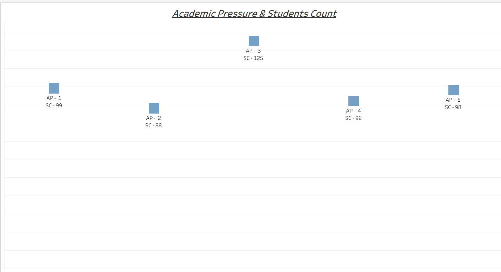
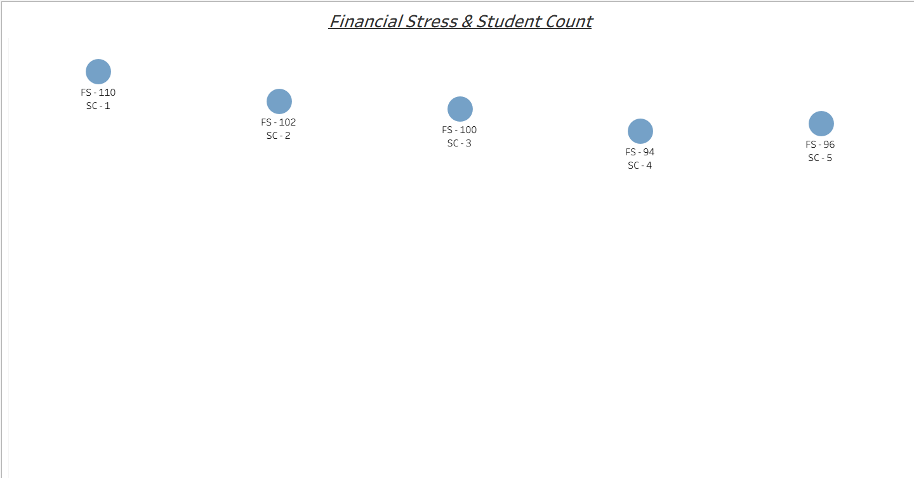
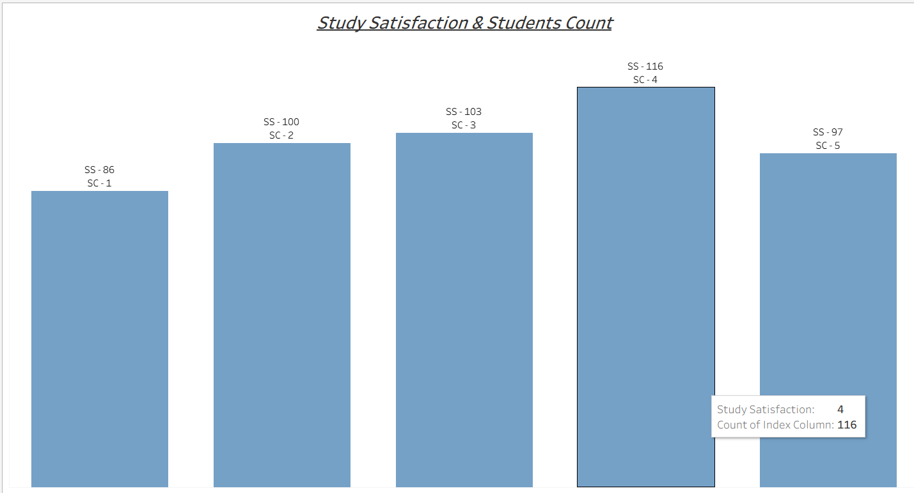
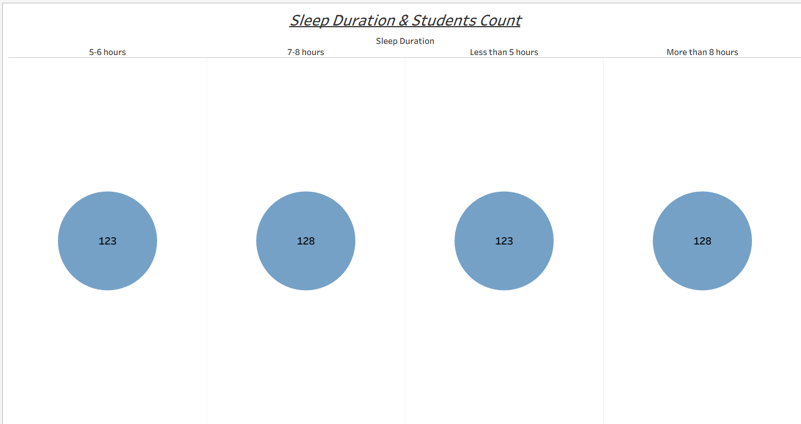
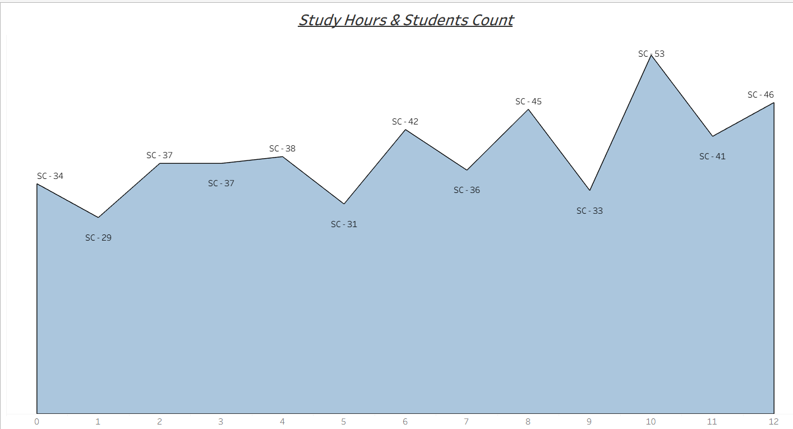

# 🎓 Student Depression Analysis Dashboard

## 📌 Project Overview

This project focuses on analyzing key factors affecting student mental health, such as academic pressure, financial stress, sleep duration, study hours, and satisfaction levels.

The goal is to identify patterns and relationships that contribute to student depression using structured data analysis and interactive visualization.

---

## 🛠️ Tech Stack

* **MS SQL Server** – Data cleaning, preprocessing, and transformation
* **Tableau Desktop** – Dashboard creation and data visualization

---

## 📂 Project Structure

```
Student-Depression-Analysis/
│
├── data/
│   └── student_depression_data.xlsx
│
├── analysis/
│   └── student_depression_dashboard.twbx
│
├── images/
│   ├── overall_dashboard.png
│   ├── academic_pressure.png
│   ├── financial_stress.png
│   ├── student_satisfaction.png
│   ├── sleep_duration.png
│   └── study_hours.png
│
└── README.md
```

---

## 📸 Dashboard Analysis

### 📊 Overall Dashboard


➡️ Provides a complete overview of all student mental health indicators in one place.

---

### 📉 Academic Pressure vs Student Count



➡️ Higher academic pressure is associated with increased student stress levels.

---

### 💰 Financial Stress vs Student Count



➡️ Financial difficulties contribute significantly to student mental health challenges.

---

### 😊 Student Satisfaction vs Student Count



➡️ Students with higher satisfaction levels tend to show lower stress indicators.

---

### 😴 Sleep Duration vs Student Count



➡️ Irregular or reduced sleep patterns impact student well-being.

---

### 📚 Study Hours vs Student Count



➡️ Balanced study hours correlate with better mental health outcomes.

---

## 🔍 Key Insights

* Academic pressure is a major factor influencing student stress
* Financial stress directly affects mental well-being
* Proper sleep and balanced study hours improve student health
* Satisfaction levels are strongly linked with lower depression indicators

---

## ⚙️ How to Use

1. Open the dataset from the `data/` folder in MS SQL Server
2. Run preprocessing queries (if applicable)
3. Open the Tableau file from the `analysis/` folder
4. Explore the interactive dashboard

---

## 📌 Future Improvements

* Add predictive analytics using machine learning
* Deploy dashboard using Tableau Public
* Integrate real-time data sources


